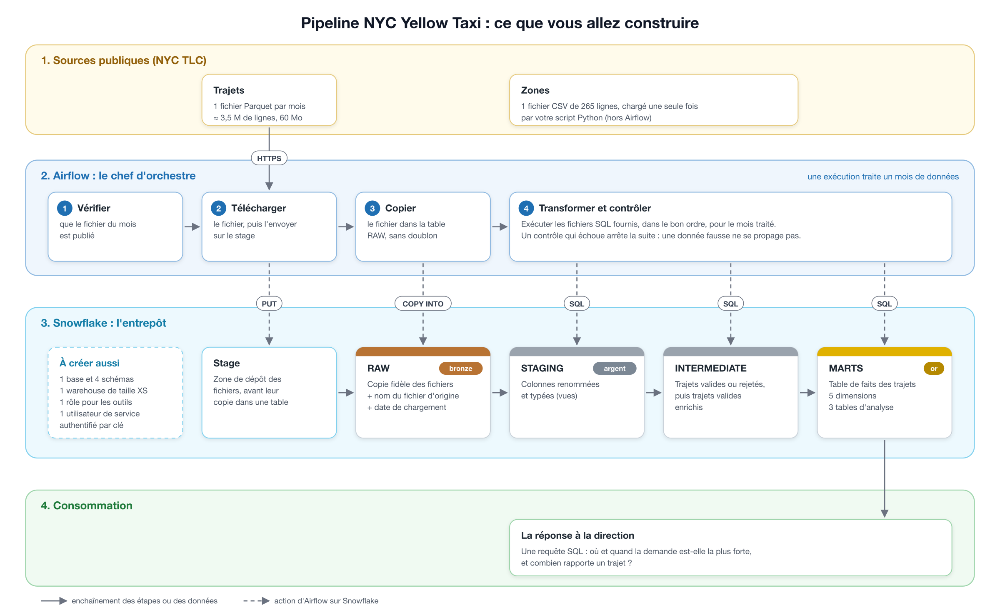
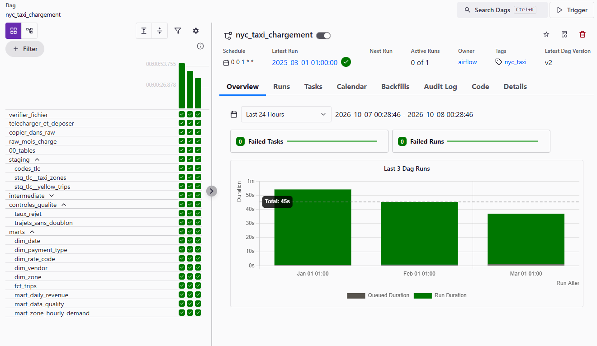

# Pipeline NYC Yellow Taxi — Snowflake et Airflow

Pipeline de données pour **Hudson Cab Partners**, flotte de 180 taxis jaunes à New York. Il charge chaque mois les trajets publiés par la Taxi and Limousine Commission (TLC) dans Snowflake, les nettoie et les transforme en couches successives, contrôle leur qualité, puis produit les tables d'analyse qui répondent à la question de la direction :

> Où et quand la demande de taxis jaunes est-elle la plus forte à New York, et combien rapporte un trajet selon la zone, l'heure et le mode de paiement ?

Le tout est orchestré par Airflow, mois par mois, sans intervention manuelle. **Périmètre : janvier, février et mars 2025** (11,2 millions de trajets).

La réponse à la direction est dans [`docs/REPONSE.md`](docs/REPONSE.md).

---

## Architecture



### Les quatre couches (architecture médaillon)

| Couche | Schéma Snowflake | Contenu | Écrite par |
|---|---|---|---|
| **RAW** | `NYC_TAXI.RAW` | Copie fidèle des fichiers TLC, sans aucune correction, avec deux colonnes techniques (`_source_file`, `_loaded_at`) | `COPY INTO` (script Python ou Airflow) |
| **STAGING** | `NYC_TAXI.STAGING` | Vues qui renomment et typent les colonnes, tables des codes TLC | fichiers SQL fournis |
| **INTERMEDIATE** | `NYC_TAXI.INTERMEDIATE` | Trajets étiquetés (valide ou motif de rejet), puis trajets valides dédoublonnés et enrichis (durée, vitesse, taux de pourboire) | fichiers SQL fournis |
| **MARTS** | `NYC_TAXI.MARTS` | Modèle en étoile (5 dimensions, 1 table de faits) et 3 tables d'analyse prêtes pour la direction | fichiers SQL fournis |

Chaque couche ne lit que la précédente. Si une règle de nettoyage change, on rejoue les transformations sans retélécharger les fichiers, puisque RAW garde tout.

### Le rôle de chaque outil

| Outil | Rôle |
|---|---|
| **Snowflake** | L'entrepôt : stockage des quatre couches et calcul de toutes les transformations (warehouse XS) |
| **Script Python** (`ingestion/`) | Chargement manuel d'un mois, ou de la liste des zones : téléchargement, dépôt sur le stage (`PUT`), copie dans RAW (`COPY INTO`) |
| **Airflow 3** (via Astro CLI, dans Docker) | L'orchestrateur : chaque mois, charge le fichier, exécute les 16 fichiers SQL dans l'ordre, lance les contrôles, et relance automatiquement en cas d'échec passager |
| **GitHub** | Le code versionné, sans aucun secret |

---

## Structure du dépôt

```
.
├── README.md                     ce fichier
├── CONTRAT_RAW.md                noms imposés de la couche RAW (fourni)
├── ETAPES.md                     détail des journées (fourni)
├── verifier_poste.sh             vérifie les outils installés (fourni)
├── pyproject.toml, uv.lock       environnement Python du script d'ingestion
├── .gitignore, .gitattributes    exclusion des secrets, fins de ligne Linux
│
├── snowflake/                    scripts SQL à lancer dans Snowsight
│   ├── 01_infrastructure.sql     warehouse, base, schémas, rôle, utilisateur de service
│   ├── 02_raw.sql                formats de fichier, stage, tables RAW
│   ├── verif_contrat.sql         vérifie que RAW respecte le contrat
│   ├── verif_pipeline.sql        comptages de toutes les tables (preuve de rejouabilité)
│   ├── requete_finale.sql        répond à la question de la direction
│   ├── anomalies.sql             comptage des anomalies et comparaison avec MART_DATA_QUALITY
│   ├── enquete_valeur_aberrante.sql   enquête sur un trajet à 132 555 $
│   ├── enquete_mode_paiement.sql      enquête carte / espèces, courses non encaissées
│   ├── droits.sql                droits du rôle des outils et accès refusés
│   └── credits.sql               crédits consommés
│
├── ingestion/                    chargement manuel en Python
│   ├── load_month.py             charge un mois (--month AAAA-MM) ou les zones (--zones)
│   ├── test_connexion.py         teste la connexion par paire de clés
│   ├── explorer_fichier.py       mesure un fichier Parquet (fiche source)
│   └── requirements.txt          dépendances
│
├── airflow/                      projet Astro
│   ├── dags/nyc_taxi_chargement.py         le pipeline complet
│   ├── dags/test_connexion_snowflake.py    prouve la connexion d'Airflow à Snowflake
│   ├── include/sql/              fichiers SQL fournis (non modifiés) + nos contrôles
│   ├── requirements.txt          dépendances installées dans l'image Docker
│   └── .env.example              format de la connexion Snowflake
│
└── docs/
    ├── architecture.png          schéma du pipeline (fourni)
    ├── fiche_trajets.md          fiche source des trajets, mesures réelles
    ├── REPONSE.md                réponse à la direction
    └── captures/                 captures d'écran
```

---

## Prérequis

| Outil | Version | Installation |
|---|---|---|
| Système | macOS, Linux, ou Windows avec **WSL (Ubuntu)** | sous Windows, tout faire dans le terminal Ubuntu, et placer le projet dans `~`, pas sous `/mnt/c` |
| Python | 3.10 ou plus récent | https://www.python.org |
| uv | récent | `curl -LsSf https://astral.sh/uv/install.sh \| sh` |
| Docker | Docker Desktop (avec l'intégration WSL activée) ou Docker Engine | https://www.docker.com |
| Astro CLI | 1.x | `curl -sSL install.astronomer.io \| sudo bash -s` (Linux, WSL) ou `brew install astro` (macOS) |
| Git et OpenSSL | — | généralement déjà installés |
| Snowflake | compte d'essai, **édition Enterprise, région européenne** | https://www.snowflake.com/en/snowflake-trial/ |

Pour vérifier le poste :
```bash
bash verifier_poste.sh      # tout doit afficher OK
```

---

## Installation pas à pas

### 1. Récupérer le projet

```bash
git clone https://github.com/MWKKA/Snowflake-Airflow.git
cd Snowflake-Airflow
```

⚠️ **Le chemin du dossier ne doit contenir ni espace ni caractère spécial** (`+`, `&`…). Docker n'arrive pas à monter un dossier dont le chemin contient un `+` sous WSL : le dossier `dags/` apparaît vide dans le conteneur.

### 2. Créer l'entrepôt Snowflake

Dans **Snowsight** (l'interface web de Snowflake), ouvrir une feuille SQL, coller le contenu de `snowflake/01_infrastructure.sql`, remplacer `<TON_UTILISATEUR>` par son identifiant (`SELECT CURRENT_USER();`), puis lancer avec **Run All** (Ctrl+Shift+Entrée).

⚠️ Ctrl+Entrée seul n'exécute que l'instruction sous le curseur.

Le script crée, avec SYSADMIN et SECURITYADMIN (jamais ACCOUNTADMIN) : le warehouse `NYC_TAXI_WH`, la base `NYC_TAXI` et ses quatre schémas, le rôle des outils `TRANSFORMER` et l'utilisateur de service `AIRFLOW_SVC`. Il est rejouable : on peut le relancer sans erreur.

### 3. Générer la paire de clés de l'utilisateur de service

L'utilisateur `AIRFLOW_SVC` n'a pas de mot de passe : il s'authentifie par clé. La clé privée reste **hors du dépôt**, dans `~/.snowflake/`.

```bash
mkdir -p ~/.snowflake && cd ~/.snowflake
openssl genrsa 2048 | openssl pkcs8 -topk8 -inform PEM -out airflow_svc_key.p8 -nocrypt
openssl rsa -in airflow_svc_key.p8 -pubout -out airflow_svc_key.pub
chmod 600 airflow_svc_key.p8

# Afficher la clé publique sur une seule ligne, sans BEGIN/END
grep -v "PUBLIC KEY" airflow_svc_key.pub | tr -d '\n'; echo
```

Dans Snowsight, donner la clé publique à l'utilisateur de service :
```sql
USE ROLE SECURITYADMIN;
ALTER USER AIRFLOW_SVC SET RSA_PUBLIC_KEY = '<clé publique sur une ligne>';
DESC USER AIRFLOW_SVC;   -- RSA_PUBLIC_KEY_FP doit commencer par SHA256:
```

🔒 La clé privée (`.p8`) ne s'envoie jamais par messagerie ni par Git.

### 4. Créer la couche RAW

Dans Snowsight, lancer `snowflake/02_raw.sql` avec **Run All**. Il crée, **avec le rôle TRANSFORMER**, les formats de fichier, le stage et les deux tables RAW. Le rôle des outils en devient propriétaire, ce qu'exige le contrat.

### 5. Préparer l'environnement Python

À la racine du dépôt :
```bash
uv sync
```

Créer un fichier **`.env`** à la racine (il est exclu de Git) :
```
SNOWFLAKE_ACCOUNT=ORGANISATION-COMPTE
SNOWFLAKE_USER=AIRFLOW_SVC
SNOWFLAKE_PRIVATE_KEY_PATH=/home/<utilisateur>/.snowflake/airflow_svc_key.p8
```
L'identifiant de compte s'obtient dans Snowsight avec `SELECT CURRENT_ORGANIZATION_NAME() || '-' || CURRENT_ACCOUNT_NAME();`. Ce n'est pas le nom d'utilisateur.

Tester la connexion :
```bash
uv run --env-file .env python ingestion/test_connexion.py
# Attendu : ('AIRFLOW_SVC', 'TRANSFORMER', 'NYC_TAXI_WH')
```

### 6. Charger la liste des zones

Le DAG ne charge que les trajets ; les 265 zones se chargent une fois, avec le script :
```bash
uv run --env-file .env python ingestion/load_month.py --zones
# Attendu : 265 zones dans RAW.TAXI_ZONE_LOOKUP
```

Le même script charge un mois à la main, par exemple pour tester :
```bash
uv run --env-file .env python ingestion/load_month.py --month 2025-01
```

### 7. Configurer Airflow

```bash
cd airflow
cp .env.example .env
```

Remplir `airflow/.env` automatiquement, sans copier la clé à la main :
```bash
KEY=$(awk 'NF {printf "%s\\n", $0}' ~/.snowflake/airflow_svc_key.p8)
ACCOUNT=$(grep SNOWFLAKE_ACCOUNT ../.env | cut -d= -f2)
cat > .env << EOF
AIRFLOW_CONN_SNOWFLAKE_NYC_TAXI='{"conn_type":"snowflake","login":"AIRFLOW_SVC","extra":{"account":"$ACCOUNT","warehouse":"NYC_TAXI_WH","database":"NYC_TAXI","role":"TRANSFORMER","private_key_content":"$KEY"}}'
EOF

# Vérifier sans afficher la clé
grep -o '"account":"[^"]*"' .env      # le bon identifiant de compte
grep -c "BEGIN PRIVATE KEY" .env      # 1
```

`airflow/.env` est exclu de Git (`.gitignore`) **et** de l'image Docker (`.dockerignore`) : la clé est transmise au conteneur au démarrage, sans jamais être copiée dans l'image.

### 8. Démarrer Airflow

```bash
astro dev start
```
Le premier démarrage télécharge les images Docker (plusieurs minutes). L'adresse de l'interface s'affiche à la fin. Sous WSL, l'ouvrir à la main dans le navigateur Windows.

**Si le téléchargement de l'image Postgres échoue** (`failed to copy ... cloudfront.docker.com ... EOF`), c'est que le réseau coupe les téléchargements depuis Docker Hub. Utiliser le miroir de Google :
```bash
docker pull mirror.gcr.io/library/postgres:12.6
astro config set postgres.repository mirror.gcr.io/library/postgres
astro config set postgres.tag 12.6
astro dev start
```

### 9. Lancer le pipeline

1. Dans l'interface d'Airflow, ouvrir le DAG `test_connexion_snowflake` et cliquer sur **Trigger** : ses logs doivent afficher `('AIRFLOW_SVC', 'TRANSFORMER', 'NYC_TAXI_WH')`.
2. Ouvrir le DAG **`nyc_taxi_chargement`** et **activer son interrupteur**.

⚠️ **Ne pas cliquer sur Trigger pour `nyc_taxi_chargement`** : une exécution manuelle prend la date du jour, et le fichier de ce mois n'existe pas. En activant l'interrupteur, Airflow crée lui-même les exécutions de janvier, février et mars 2025 (`catchup`) et les lance l'une après l'autre.

### 10. Vérifier

Dans Snowsight, lancer `snowflake/verif_pipeline.sql`. Résultats attendus :

| Table | Lignes |
|---|---|
| `RAW.YELLOW_TRIPDATA` | 11 198 026 |
| `RAW.TAXI_ZONE_LOOKUP` | 265 |
| `INTERMEDIATE.INT_TRIPS__FLAGGED` | 11 198 026 |
| `MARTS.FCT_TRIPS` | 10 382 378 |
| `MARTS.MART_ZONE_HOURLY_DEMAND` | 11 524 |
| `MARTS.MART_DATA_QUALITY` | 18 |

---

## Le DAG `nyc_taxi_chargement`



Une exécution traite **un mois**, déduit de sa **date logique** (`logical_date`), jamais de la date du jour. 21 tâches, dans cet ordre :

| Étape | Tâches | Rôle |
|---|---|---|
| Chargement | `verifier_fichier` → `telecharger_et_deposer` → `copier_dans_raw` | vérifie que la TLC a publié le fichier, le télécharge, l'envoie sur le stage, le copie dans RAW |
| Contrôle | `raw_mois_charge` (fourni) | le mois est bien présent dans RAW |
| Tables | `00_tables` | crée les tables alimentées mois par mois |
| `staging` | 3 tâches en parallèle | vues de renommage et tables de codes |
| `intermediate` | `int_trips__flagged` → `int_trips__enriched` | étiquetage des rejets, puis trajets valides enrichis |
| `controles_qualite` | `trajets_sans_doublon`, `taux_rejet` (écrits par nous) | aucun doublon ; taux de rejet sous le seuil |
| `marts` | 5 dimensions, `fct_trips`, 3 tables d'analyse | modèle en étoile et analyses |

**L'ordre a été déduit des fichiers SQL** : chaque fichier lit des tables (`FROM`, `JOIN`) et en crée une, il s'exécute donc après ceux qui créent les tables qu'il lit.

**Les contrôles qualité sont placés avant les marts.** Si l'un échoue, les tables lues par la direction ne sont pas mises à jour : elles gardent le contenu de la dernière exécution réussie.

### Rejouer un mois

Dans l'interface, ouvrir l'exécution du mois, **Clear Run → Clear existing tasks**. Les comptages de `verif_pipeline.sql` restent identiques (aucun doublon).

### Ajouter un quatrième mois

Dans `nyc_taxi_chargement.py`, repousser `end_date` (par exemple `datetime(2025, 4, 30)`) et le paramètre `end_month` (`"2025-05-01"`, utilisé par `dim_date`). Airflow crée alors automatiquement l'exécution d'avril. Rien d'autre ne change : le nom du fichier est calculé à partir du mois.

---

## Choix techniques

### Sécurité et droits

- **Trois rôles, des responsabilités séparées.** SYSADMIN crée le stockage et le calcul, SECURITYADMIN crée les rôles et les droits, et **TRANSFORMER**, le rôle des outils, ne reçoit que ce que le contrat exige. ACCOUNTADMIN n'est jamais utilisé par les outils.
- **Moindre privilège.** TRANSFORMER peut charger RAW et créer des tables et des vues dans les trois autres schémas, rien de plus. Il ne peut ni créer de base, ni lire une autre base, ni supprimer `NYC_TAXI` (preuves dans `snowflake/droits.sql`). Si la clé d'Airflow fuitait, les dégâts resteraient limités à la base du projet.
- **Utilisateur de service authentifié par paire de clés.** `AIRFLOW_SVC` (`TYPE = SERVICE`) n'a pas de mot de passe et ne peut pas se connecter à l'interface web.
- **Aucun secret dans Git ni dans l'image Docker.** La clé privée est dans `~/.snowflake/`, hors du dépôt ; les fichiers `.env` sont exclus par `.gitignore` et `.dockerignore` ; le code ne contient que le **nom** de la connexion (`snowflake_nyc_taxi`).

### Entrepôt

- **Warehouse XS, suspension automatique après 60 secondes.** Un mois complet du pipeline se traite en moins d'une minute sur la plus petite taille : une taille supérieure coûterait plus cher sans rien apporter. Snowflake facture tant que le warehouse est allumé ; la suspension rapide est le réglage qui pèse le plus sur la facture (voir « Résultats »).
- **Un stage interne.** `COPY INTO` charge depuis un stage. Il découple le dépôt du fichier de sa copie dans la table, et Snowflake y garde l'**historique des fichiers chargés**, ce qui empêche les doublons.
- **Des types larges en RAW.** Les montants et la distance sont en `FLOAT`, et non en `NUMBER`, qui vaut `NUMBER(38,0)` et arrondirait les montants (12,50 deviendrait 13). Une même colonne peut être entière un mois et décimale le suivant. RAW est une copie fidèle : aucune contrainte, aucun rejet, le nettoyage se fait plus loin.
- **`MATCH_BY_COLUMN_NAME = CASE_INSENSITIVE`.** Les colonnes du fichier sont associées à celles de la table par leur nom, pas par leur position : un mois qui ajoute ou retire une colonne se charge quand même (par exemple `cbd_congestion_fee`, apparue en 2025, ou `Airport_fee` avec sa majuscule).
- **`USE_LOGICAL_TYPE = TRUE`** pour lire les dates Parquet comme des dates, et **`AUTO_COMPRESS = FALSE`** au `PUT` pour conserver le nom exact du fichier dans `_source_file`.

### Rejouabilité

Relancer un mois ne crée aucun doublon, à chaque niveau :

| Niveau | Mécanisme |
|---|---|
| RAW | `COPY INTO` ignore un fichier déjà chargé (historique de chargement) |
| INTERMEDIATE, `FCT_TRIPS` | `DELETE` des lignes du mois, puis `INSERT` |
| Vues, dimensions, marts | reconstruits entièrement (`CREATE OR REPLACE`) |

### Orchestration

- **La date logique** : chaque exécution traite sa période. Avec la date du jour, impossible de rejouer un mois passé.
- **`catchup=True`** (désactivé par défaut en Airflow 3) pour rejouer janvier à mars ; **`max_active_runs=1`** pour traiter un mois à la fois ; **`retries=2`** pour absorber les pannes passagères (réseau).
- **Une tâche par fichier SQL**, regroupées par couche avec des `TaskGroup`. Les contrôles ont `retries=0` : un contrôle en échec doit échouer tout de suite.
- **Le seuil du taux de rejet (15 %) a été mesuré avant d'être fixé** : le taux réel est de 6,4 % à 7,7 % selon le mois. Le seuil, environ deux fois le taux habituel, ne déclenche pas sur les variations normales mais signale un fichier anormal.

---

## Résultats

- **10 382 378 trajets valides** sur 11 198 026 : 815 648 trajets (7,3 %) écartés par les règles de qualité.
- **Les anomalies ont été recomptées indépendamment**, à partir des données brutes, et retrouvent exactement les chiffres de `MART_DATA_QUALITY` (`snowflake/anomalies.sql`).
- **Coût de tout le projet** : 0,507 crédit pour `NYC_TAXI_WH`, développement et tests compris (`snowflake/credits.sql`).
- **Réponse à la direction** : [`docs/REPONSE.md`](docs/REPONSE.md).

---

## Problèmes rencontrés

| Problème | Cause | Solution |
|---|---|---|
| `verifier_poste.sh: syntax error: unexpected end of file` | fins de ligne Windows (CRLF) | `sed -i 's/\r$//' verifier_poste.sh`, puis `.gitattributes` (`* text=auto eol=lf`) pour toujours garder les fins de ligne Linux |
| `astro dev start` : `failed to copy ... cloudfront.docker.com ... EOF` | le réseau coupe les téléchargements depuis Docker Hub | image Postgres téléchargée depuis le miroir `mirror.gcr.io` (étape 8) |
| DAG invisible dans Airflow, dossier `dags/` vide dans le conteneur | caractère `+` dans le chemin du projet : Docker ne trouve pas le dossier à monter | renommer le dossier sans caractère spécial |
| `Insufficient privileges to operate on schema` | objets créés avec ACCOUNTADMIN : les autres rôles ne les voient pas | toujours commencer un script par `USE ROLE SYSADMIN;` (ou le rôle voulu) |
| `COMPUTE_WH` a coûté trois fois plus que le pipeline | warehouse par défaut du compte d'essai, suspension après 5 minutes, utilisé par les requêtes manuelles | `AUTO_SUSPEND = 60` et `NYC_TAXI_WH` comme warehouse par défaut de l'utilisateur (`snowflake/credits.sql`) |
| Un trajet à 132 555 $ faussait une moyenne | erreur de saisie, aucune règle ne plafonne les montants | filtre dans la requête finale ; règle à ajouter en amont (`snowflake/enquete_valeur_aberrante.sql`) |

---

## Captures d'écran

Dans [`docs/captures/`](docs/captures/) : les trois exécutions réussies, le graphe du DAG, un contrôle en échec, l'historique de chargement Snowflake, les droits du rôle des outils et un accès refusé, le suivi des crédits.

---

## Auteurs

- Alexandre Fantin — [@MWKKA](https://github.com/MWKKA)

Projet réalisé dans le cadre de la formation Data Engineer (Simplon).